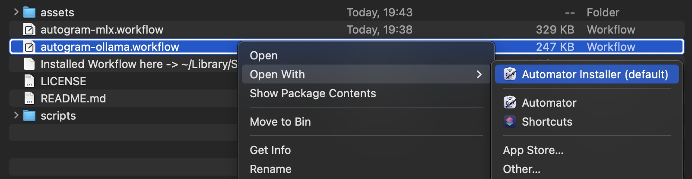
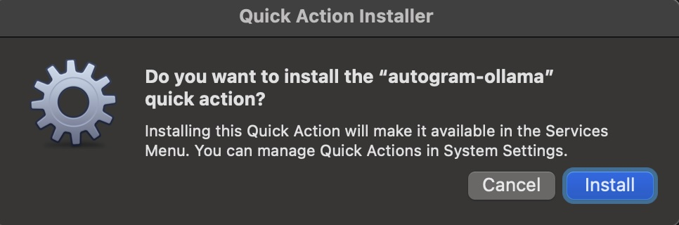
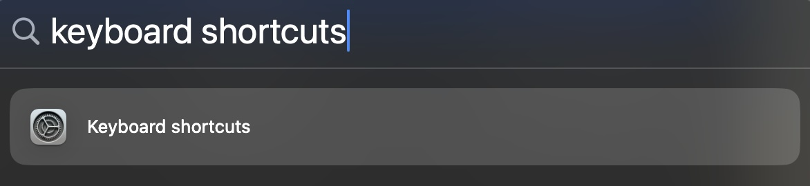
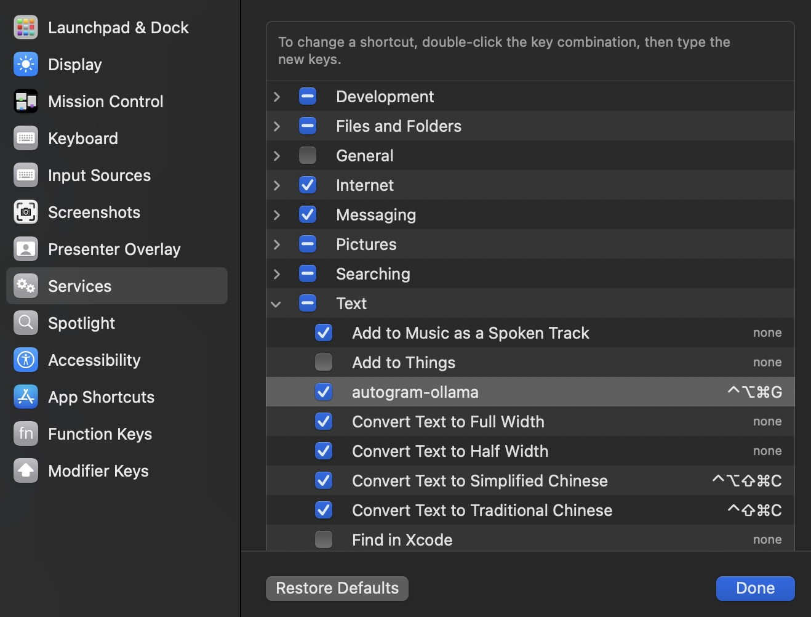
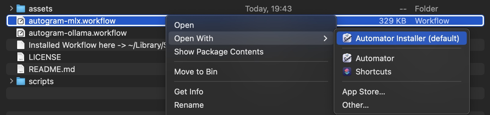

# Autogram


## Ollama Backend

### Installation

Install [ollama](https://ollama.ai/)

Run in the background to download a Mistral Instruct 0.2 based model:

```bash
ollama run ifioravanti/mistral-grammar-checker
```
Note: If you have Mistral Instruct 7b Instruct 0.2 already installed in Ollama, only a very small additional layer will be downloaded.
You can easily create new custom model using custom ModelFiles [following instructions on Ollama](https://github.com/ollama/ollama/blob/main/docs/modelfile.md)

Install the workflow. This essentially copies the workflow to `~/Library/Services/autogram-ollama.workflow`.





Go to System Preferences -> Keyboard -> Shortcuts -> Services -> General -> autogram, and set the shortcut, in my case I set it to `⌃⌥⌘G`.





### Usage

In any OSX application, select some text, and press the shortcut you set. The selected text will be replaced with the generated text from the model.

## Apple MLX Backend

Install `autogram-mlx.workflow` the same way as above, no need to edit and add token, however you may edit `MODEL="mistral"`, in case you want to use a different model



This worfklow is based on mlx-community/Mistral-7B-Instruct-v0.2-4bit-mlx model with prompt defined directly in the workflow.
You can edit it directly from Automator.